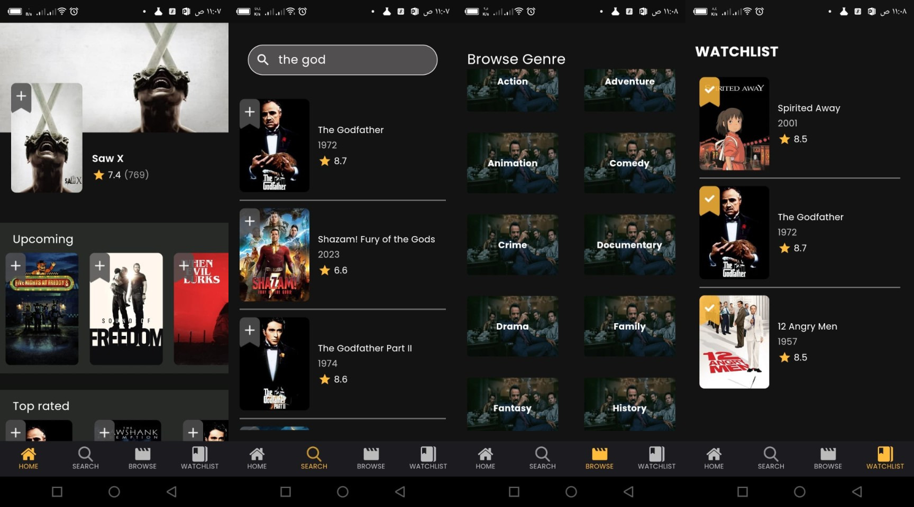

# Movies App
## Movie app using TMDB Data base
 
## Overview
Powerful movie app utilizing TMDB API and using different end points of the api, the user can view popular movies, upcoming movies, top rated movies, search by movie name, show movies for each category all this using **Cubit for state management**, **http for API calls** and **Hive for local data storage so the user can add movies to watchlist**.

#### Screenshots

------------------------------

